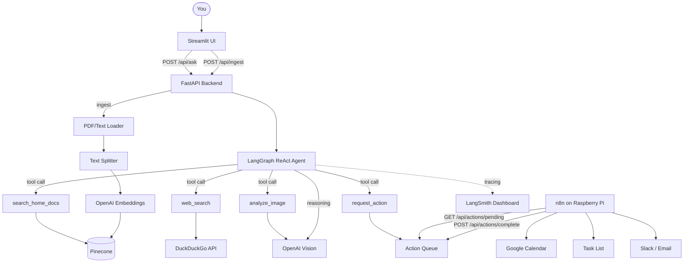

# Home Intelligence Agent

A personal AI agent that answers questions about your home using your actual documents. Upload inspection reports, mortgage docs, appliance manuals, warranties, and more. The agent retrieves relevant info from your documents, searches the web when needed, and can queue actions like calendar events and maintenance tasks.

Built with FastAPI, LangGraph, Pinecone, and OpenAI.

## What it does

- Ask questions about your home and get answers grounded in your documents
- Upload PDFs and text files that get chunked, embedded, and stored in Pinecone
- Agent decides which tools to use on its own (document search, web search, image analysis)
- Queues actions (calendar events, tasks, notifications) for n8n to execute
- Maintains conversation memory within a session

## Tech stack

- **FastAPI** - API backend
- **LangGraph** - ReAct agent with tool calling loop
- **Pinecone** - Vector store for document retrieval (RAG)
- **OpenAI** - LLM (gpt-4o-mini) and embeddings (text-embedding-3-small)
- **LangSmith** - Agent tracing and evals
- **n8n** - Automation layer for executing actions (runs on a Raspberry Pi)
- **Streamlit** - Frontend UI

## Current status

Working locally with:
- Document ingestion pipeline (PDF and text)
- ReAct agent with search_home_docs, web_search, analyze_image, and request_action tools
- In-memory action queue with pending/complete/history endpoints
- Session memory via LangGraph checkpointing
- Structured logging and LangSmith tracing

## What's left to build

- Unit and integration tests (pytest)
- Eval dataset and runner
- GitHub Actions CI/CD (tests on dev, tests + evals on main)
- Render deployment (dev and prod environments)
- Streamlit UI (chat interface, document upload, action history)
- n8n workflows (action polling, Google Calendar integration, auto-ingest from Google Drive)

## Running locally

```bash
python -m venv venv
source venv/bin/activate
pip install -r requirements.txt
```

Copy `.env.example` to `.env` and fill in your API keys.

```bash
uvicorn app.main:app --reload
```

API docs at `http://127.0.0.1:8000/docs`

## API endpoints

- `POST /api/ingest` - Upload and ingest a document
- `POST /api/ask` - Ask the agent a question
- `GET /api/actions/pending` - Get queued actions (n8n polls this)
- `POST /api/actions/complete` - Mark an action as done
- `GET /api/actions/history` - View all actions

## Architecture

