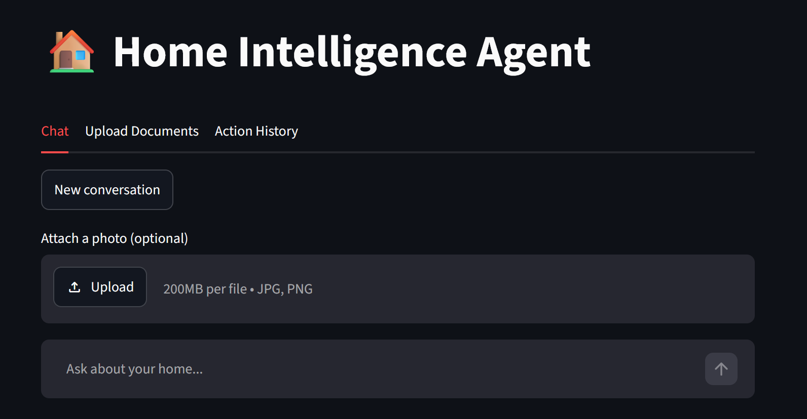
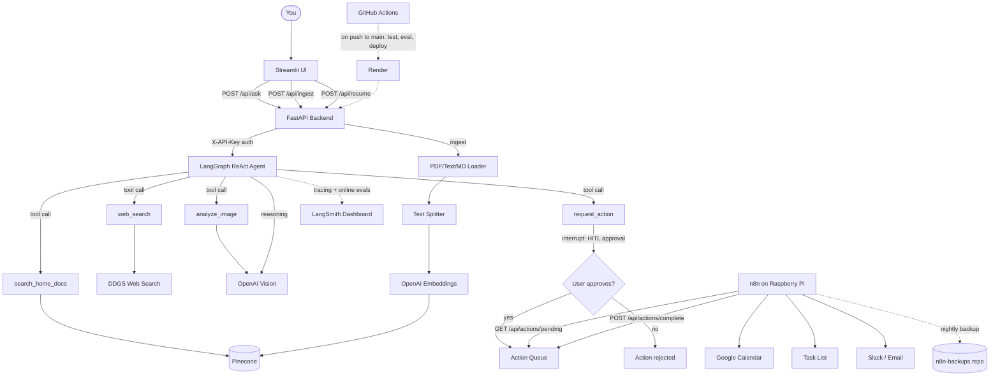
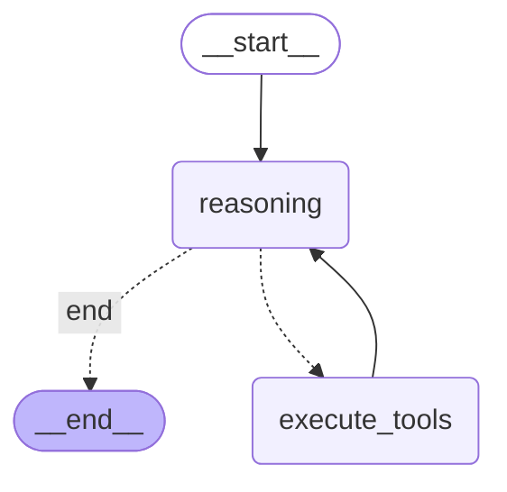

# Home Intelligence Agent

A personal AI agent that answers questions about your home using your actual documents. Upload inspection reports, mortgage docs, appliance manuals, warranties, and more. The agent retrieves relevant info from your documents, searches the web when needed, and can queue actions like calendar events and maintenance tasks.

Built with FastAPI, LangGraph, Pinecone, and OpenAI. MVP is complete and deployed.



## What it does

- Ask questions about your home and get answers grounded in your documents
- Upload PDFs, text, and Markdown files that get chunked, embedded, and stored in Pinecone
- Agent decides which tools to use on its own (document search, web search, image analysis)
- Requests actions (calendar events, tasks, notifications), gated behind human approval, then queues them for n8n to execute
- Maintains conversation memory within a session

## Tech stack

- **FastAPI** - API backend, secured with an API key on all routes
- **LangGraph** - ReAct agent with tool calling loop and human-in-the-loop (HITL) approval interrupts
- **Pinecone** - Vector store for document retrieval (RAG)
- **OpenAI** - LLM (gpt-4o-mini) and embeddings (text-embedding-3-small)
- **LangSmith** - Agent tracing plus online evals running against live traffic
- **n8n** - Automation layer for executing actions, self-hosted on a Raspberry Pi at [n8n.bobohouse.uk](https://n8n.bobohouse.uk/), with nightly workflow backups to [n8n-backups](https://github.com/Ben-Bobo/n8n-backups)
- **Streamlit** - Frontend UI (chat, document upload, action history), deployed at [bobo-home-intelligence-agent.streamlit.app](https://bobo-home-intelligence-agent.streamlit.app/)
- **GitHub Actions** - CI on PRs (tests) and CD on `main` (tests, offline evals, then deploy)
- **Render** - Production hosting for the FastAPI backend

## Current status (MVP complete)

- Document ingestion pipeline (PDF, text, Markdown)
- ReAct agent with `search_home_docs`, `web_search`, `analyze_image`, and `request_action` tools
- Human-in-the-loop approval on every requested action before it's queued
- Action queue with pending/complete/history endpoints, polled by n8n
- Session memory via LangGraph checkpointing
- API key auth (`X-API-Key`) on all endpoints
- Structured logging and LangSmith tracing + online evals
- Offline eval dataset and runner (`evals/`), gated in CI on `main`
- GitHub Actions CI/CD: PR tests, and on `main` — tests, evals, then deploy to Render
- Streamlit UI for chat, document upload, and action history
- n8n workflow polling the action queue and executing calendar/task/notification actions, running on a Raspberry Pi with automated nightly backups to GitHub

## What's left to build

- Google Calendar / Drive integrations in n8n (auto-ingest from Drive, calendar sync)
- Expand eval dataset coverage as new tools/actions are added

## Deployments

- **Streamlit UI**: [bobo-home-intelligence-agent.streamlit.app](https://bobo-home-intelligence-agent.streamlit.app/)
- **FastAPI backend**: Render (deployed automatically on push to `main`, after tests + evals pass)
- **n8n**: [n8n.bobohouse.uk](https://n8n.bobohouse.uk/), self-hosted on a Raspberry Pi, nightly workflow backups to [n8n-backups](https://github.com/Ben-Bobo/n8n-backups)

## Running locally

```bash
python -m venv venv
source venv/bin/activate
pip install -r requirements.txt
```

Copy `.env.example` to `.env` and fill in your API keys, including `API_SECRET_KEY` (used to authenticate requests).

```bash
uvicorn app.main:app --reload
```

API docs at `http://127.0.0.1:8000/docs`

To run the Streamlit UI locally, set `API_URL` and `API_SECRET_KEY` in `.streamlit/secrets.toml`, then:

```bash
streamlit run streamlit_app.py
```

## Tests and evals

```bash
pytest tests/ -v
python evals/run_evals.py
```

Offline evals score tool selection, action correctness, and answer quality (via LLM-as-judge) against `evals/dataset.json`, with thresholds defined in `evals/config.json`. LangSmith also runs online evals against live production traffic.

## API endpoints

All endpoints require an `X-API-Key` header matching `API_SECRET_KEY`.

- `POST /api/ingest` - Upload and ingest a document
- `POST /api/ask` - Ask the agent a question (may pause for HITL approval on requested actions)
- `POST /api/resume` - Approve or reject a pending action and resume the agent
- `GET /api/actions/pending` - Get queued actions (n8n polls this)
- `POST /api/actions/complete` - Mark an action as done
- `GET /api/actions/history` - View all actions

## Architecture



## Agent Graph
```powershell
python -c "from app.agent.graph import agent; print(agent.get_graph().draw_mermaid())"
```

